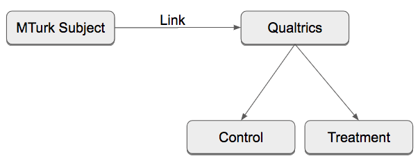
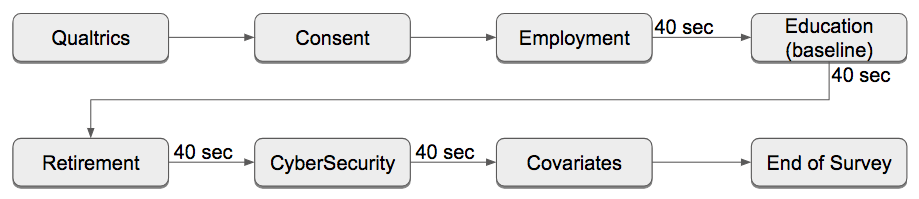

# Introduction 

The unfortunate aspect about American politics is that political polarization has become a defining norm. It becomes more apparent from the approval rating when a polarizing candidate steps in to office, like in the case of Donald J. Trump when he won the election as president of the United States. According to the 2017 surveys conducted by the Pew Research Center, 88% of Republicans approved of Trump's first year in office in contrast to the dismal 8% from the Democrats [1]. 

But with the Russian investigation, high staff turnover rates, and Trump's failure to fulfill his campaign promises, it has left many Americans, including Republicans, doubtful that their interests are being served. Or at least, that is what several media outlets claim. 

For this reason, we decided to conduct an experiment to see if the political divide and rise of pessimism were as accurate as the media portrayed. We selected four topics, each of which has considerable relevance to a person living in the United States and is neutral across political lines. By inserting Trump into these topics, we hope to address the media portrayal in two-fold:

* Political polarization: Are we (as America) divided enough in political partisanship to have different level of optimism regardless of Trump?
* Rise of pessimism due to Trump: Is the rise of pessimism strong enough that anything Donald Trump says or does will trigger a level of anger regardless of the person's political affiliation?

By having the latter question as the basis of our research question, we will gain insight to both of these questions and in turn a better understanding of the media portrayal of the American public. 

# Research Question

Does the subtle mention of Donald Trump's name affect the level of optimism people have in general?

```{r include=FALSE}
# Tiffany: Not sure if the following questions are necessary since they are mostly addressed in the Introduction.
```

**Why is this interesting to someone who is predisposed to be interested?** 

U.S. media has come under intense scrutiny recently for its bias reporting and sensationalizing news. Recently, rising wave of pessimism has been portrayed through many news and social media outlets about the Trump administration, and we would like to verify whether the optimism people have are consistent to the extremes being portrayed in the media. 

**What other people know about this?**

It is a shared public knowledge that Trump presidency has caused a rise of pessimism in the American public, but as far as we know, there has not been any experiment done to address this issue. 

**What (if any) observational work has to say about this question?**

Professor Christopher Borick from the Muhlenberg College Institute of Public Opinion conducted a survey similar to ours where he wants to determine the level of optimism American workers have in employment outloook a year after President Trump's election [2]. He found that a large portion of Americans do not feel differently about their employment outlook since Trump's victory. It was interesting to note, however, that men were twice as likely as women to be more optimistic. Whites shared greater enthusiasm about their employment outlook. The less-educated were modestly more optimistic than those who earn a bachelor degree or higher. Lastly, rural Americans exuded less optimism that might come about from Trump's not fulfilling his promise to revitalise these communities. 

# Hypothesis 

Given the strong emotional response that Trump elicits from people across the political spectrum, we hypothesize that even a subtle mention of his name can momentarily affect the immediate level of optimism some Americans have on priorities that should be considered important and neutral across political lines, like employment, education, retirement, and cybersecurity. Whether the effect will be more positive or more negative, we assume it will be similar to the dividing attitudes in the news media. Conservatives will be more optimistic than liberals when it comes down to the association of Trump's name, but like the media in general, we expect the optimism will largely go downhill with the treatment of Trump applied to any topic. 

# Experiment 

```{r, include=FALSE}
# load the library
library(data.table) 
library(dplyr)
library(geonames)
library(lmtest) 
library(lubridate) 
library(sandwich) 
library(RJSONIO)
library(stargazer)
```

```{r, include=FALSE}
# helper function 
convert_fctr_to_boolean <- function(col) {
  return(as.numeric(as.logical(col)))
}
convert_fctr_to_datetime <- function(col) {
  return(as.POSIXct(col, format="%Y-%m-%d %H:%M:%S"))
}
convert_fctr_to_numeric <- function(col) {
  return(as.numeric(levels(col)[col]))
}
convert_fctr_to_str <- function(col) {
  return(as.character(col))
}

# load the dataset
d <- read.csv(file = "data/W241 Colby Carter, Tiffany Jaya, Abhishek Agarwal_April 22, 2018_15.32.csv",
              header = TRUE, 
              sep = ",")

# remove the first two rows
d <- tail(d, -2)

# rename columns to be more descriptive
setnames(d, 
         old = c("Q1.1", 
                 "Q2.2_1",
                 "Q2.3_1",
                 "Q2.5_1",
                 "Q2.7_1",
                 "Q3.1_1", 
                 "Q3.3_1",
                 "Q3.5_1",
                 "Q3.7_1",
                 "Q4.1",
                 "Q4.2",
                 "Q4.3",
                 "Q4.4",
                 "Q4.5",
                 "Q4.6",
                 "Q4.7",
                 "Q4.8",
                 "Q4.9",
                 "Q4.10",
                 "Q4.11",
                 "Q4.12",
                 "Q4.13",
                 "Q4.14",
                 "Q4.15",
                 "Q4.16", 
                 "Q2.1_First.Click",
                 "Q2.1_Last.Click",
                 "Q2.1_Page.Submit",
                 "Q2.1_Click.Count",
                 "Q2.4_First.Click",
                 "Q2.4_Last.Click",
                 "Q2.4_Page.Submit",
                 "Q2.4_Click.Count",
                 "Q2.6_First.Click",
                 "Q2.6_Last.Click",
                 "Q2.6_Page.Submit",
                 "Q2.6_Click.Count",
                 "Q2.8_First.Click",
                 "Q2.8_Last.Click",
                 "Q2.8_Page.Submit",
                 "Q2.8_Click.Count",
                 "Q3.2_First.Click",
                 "Q3.2_Last.Click",
                 "Q3.2_Page.Submit",
                 "Q3.2_Click.Count",
                 "Q3.4_First.Click",
                 "Q3.4_Last.Click",
                 "Q3.4_Page.Submit",
                 "Q3.4_Click.Count",
                 "Q3.6_First.Click",
                 "Q3.6_Last.Click",
                 "Q3.6_Page.Submit",
                 "Q3.6_Click.Count",
                 "Q3.8_First.Click",
                 "Q3.8_Last.Click",
                 "Q3.8_Page.Submit",
                 "Q3.8_Click.Count"),
         new = c("consent", 
                 "control_employment",
                 "control_education", # baseline
                 "control_retirement",
                 "control_cybersecurity",
                 "treatment_employment",
                 "treatment_education", # baseline,
                 "treatment_retirement",
                 "treatment_cybersecurity",
                 "gender",
                 "age",
                 "highest_education",
                 "employment_status",
                 "marital_status",
                 "zip_code",
                 "community", # rural, urban, suburban
                 "can_vote",
                 "political_party",
                 "ethnicity",
                 "income",
                 "have_kids",
                 "internet_from_mobile",
                 "internet_from_home",
                 "internet_from_work",
                 "who_pays_internet",
                 "control_employment_First.Click",
                 "control_employment_Last.Click",
                 "control_employment_Page.Submit",
                 "control_employment_Click.Count",
                 "control_education_First.Click",
                 "control_education_Last.Click",
                 "control_education_Page.Submit",
                 "control_education_Click.Count",
                 "control_retirement_First.Click",
                 "control_retirement_Last.Click",
                 "control_retirement_Page.Submit",
                 "control_retirement_Click.Count",
                 "control_cybersecurity_First.Click",
                 "control_cybersecurity_Last.Click",
                 "control_cybersecurity_Page.Submit",
                 "control_cybersecurity_Click.Count",
                 "treatment_employment_First.Click",
                 "treatment_employment_Last.Click",
                 "treatment_employment_Page.Submit",
                 "treatment_employment_Click.Count",
                 "treatment_education_First.Click",
                 "treatment_education_Last.Click",
                 "treatment_education_Page.Submit",
                 "treatment_education_Click.Count",
                 "treatment_retirement_First.Click",
                 "treatment_retirement_Last.Click",
                 "treatment_retirement_Page.Submit",
                 "treatment_retirement_Click.Count",
                 "treatment_cybersecurity_First.Click",
                 "treatment_cybersecurity_Last.Click",
                 "treatment_cybersecurity_Page.Submit",
                 "treatment_cybersecurity_Click.Count"))

# remove rownames to avoid confusion (because it is not the subject's id)
rownames(d) <- NULL

# safely convert columns of type factors to their respective types
# 1.factor -> datetime
cols <- c("StartDate", "EndDate", "RecordedDate")
d[,cols] <- lapply(d[,cols], convert_fctr_to_datetime)
# 2. factor -> logical/boolean
cols <- c("Finished")
d[,cols] <- lapply(d[,cols], convert_fctr_to_boolean)
d$consent <- ifelse(d$consent == "Yes", 1, 0)
d$can_vote <- ifelse(d$can_vote == "Yes", 1, 0)
d$have_kids <- ifelse(d$have_kids == "Yes", 1, 0)
# 3. factor -> numeric
cols <- c("Progress", 
          "Duration..in.seconds.", 
          "LocationLatitude", 
          "LocationLongitude",
          "control_employment", 
          "control_education", 
          "control_retirement", 
          "control_cybersecurity",
          "treatment_employment", 
          "treatment_education", 
          "treatment_retirement", 
          "treatment_cybersecurity",
          "zip_code",
          "control_employment_First.Click", 
          "control_employment_Last.Click", 
          "control_employment_Page.Submit", 
          "control_employment_Click.Count", 
          "control_education_First.Click",
          "control_education_Last.Click",
          "control_education_Page.Submit",
          "control_education_Click.Count",
          "control_retirement_First.Click",
          "control_retirement_Last.Click",
          "control_retirement_Page.Submit",
          "control_retirement_Click.Count",
          "control_cybersecurity_First.Click",
          "control_cybersecurity_Last.Click",
          "control_cybersecurity_Page.Submit",
          "control_cybersecurity_Click.Count",
          "treatment_employment_First.Click",
          "treatment_employment_Last.Click",
          "treatment_employment_Page.Submit",
          "treatment_employment_Click.Count",
          "treatment_education_First.Click",
          "treatment_education_Last.Click",
          "treatment_education_Page.Submit",
          "treatment_education_Click.Count",
          "treatment_retirement_First.Click",
          "treatment_retirement_Last.Click",
          "treatment_retirement_Page.Submit",
          "treatment_retirement_Click.Count",
          "treatment_cybersecurity_First.Click",
          "treatment_cybersecurity_Last.Click",
          "treatment_cybersecurity_Page.Submit",
          "treatment_cybersecurity_Click.Count"
          )
d[,cols] <- lapply(d[,cols], convert_fctr_to_numeric)
# 4. factor -> str
cols <- c("IPAddress", "ResponseId", "UserLanguage", "highest_education")
d[,cols] <- lapply(d[,cols], convert_fctr_to_str)

# get country information based on latlong
options(geonamesUsername="sullivannicole") # login
country_names <- mapply(
  function(lat, long) {
    suppressWarnings(try(GNcountryCode(lat, long)$countryName, silent = TRUE))
  }, d$LocationLatitude, d$LocationLongitude)
d$country <- country_names

# save a copy of the original dataset
data <- d

# filter for subjects who finish the survey 100%
d <- d %>% filter(., Progress == 100)

# filter for subjects who consented to take the survey
d <- d[which(d$consent == 1),]

# filter for subjects who are from USA
d <- d %>% filter(., country == "United States")

# filter out subjects who took the survey more than once
subjects.repeater <- d %>% group_by(IPAddress) %>% summarize(freq = sum(n())) %>% filter(freq > 1)
d <- d %>% filter(!(IPAddress %in% subjects.repeater$IPAddress))
```

## Research Design


The purpose of the study 
The strategies
The time diemnsion 
The research environment
Unit of analysis
Sampling design
Data collection method
Measurement
Data Analysis

## Randomization Engineering





Out of 638 subjects, 580 reside in the United States, 58 reside outside of the United States

```{r}
# how many subjects are from United States?
data %>% filter(., country == "United States") %>% count(.)
# how many subjects are from outside the United States?
data %>% filter(., country != "United States") %>% count(.)
```

Out of 638 subjects, 580 subjects are from the United States and 58 are from outside the United States.

```{r}
data %>% group_by(country) %>% summarize(countries = unique(country), freq=sum(n()))
```

```{r}
library(maps)
library(ggplot2)
world_map <- map_data("world")
world_map <- world_map[world_map$region != "Antartica",]
gg <- ggplot(world_map)
gg <- gg + geom_map(data = world_map, 
                    map = world_map, 
                    aes(x=long, y=lat, map_id = region),
                    fill = "white",
                    color = "gray70")
geomap1 <- unique(data, by=c("LocationLatitude", "LocationLongitude"))
gg <- gg + geom_point(data = geomap1,
                      aes(LocationLongitude, LocationLatitude),
                      colour="red", 
                      alpha = 1/10,
                      size = 0.5)
print(gg)
```

Remove repeater, same IP different zip codes

Show 

## Experimental Materials

## Measurement of variables

## Modeling choices

# Result

Clean, clear, well articulated relationships between your theory, your hypotheses, the numbers that your models produce, and the figures you present

# References

1. Smith, Samantha. “The Partisan Divide on Political Values Grows Even Wider.” Pew Research Center for the People and the Press, 5 Oct. 2017, www.people-press.org/2017/10/05/the-partisan-divide-on-political-values-grows-even-wider/.
2. Borick, Christopher. “Capital - Are American Workers More Optimistic under Trump?” BBC, BBC, 8 Nov. 2017, www.bbc.com/capital/story/20171108-are-american-workers-more-optimistic-under-trump.